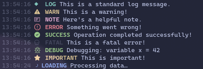

<h1 align="center">
  Kleurr
</h1>

<h4 align="center" id="about">
 A lightweight console logging prettifier for Node.js, designed with simplicity and readability in mind.</h4>

<div align="center">
  
</div>

<p align="center">
  <a href="https://www.npmjs.com/package/@averagecryptonerd/kleurr">
  </a>
</p>


## Contents

- [About](#about)
- [Install](#install)
- [Usage](#usage)

## Install

### Through NPM:

```bash
npm install @averagecryptonerd/kleurr
```

## Usage

### Default Loggers

Import Kleurr and start using any of the default loggers.

<details>
<summary>Available loggers:</summary>

<br/>

- `log`
- `warn`
- `note`
- `error`
- `success`

</details>

<br/>

### Basic Logging
```javascript
const kleurr = require("@averagecryptonerd/kleurr");

kleurr.log("This is a regular log message.");
kleurr.warn("This is a warning!");
kleurr.note("Here's a helpful note.");
kleurr.error("Something went wrong!");
```

### Custom Logging
```javascript
kleurr.registerType("success", "\x1b[42m", "\x1b[30m"); // green background, black text
kleurr.success("Operation completed successfully!");
```
> You can create as many custom types as you like by specifying the background and text colors using ANSI escape codes.
